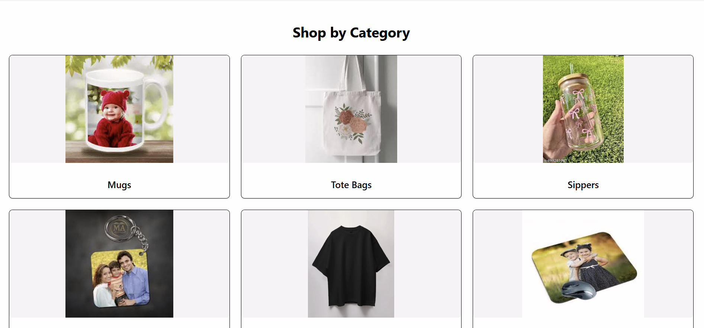
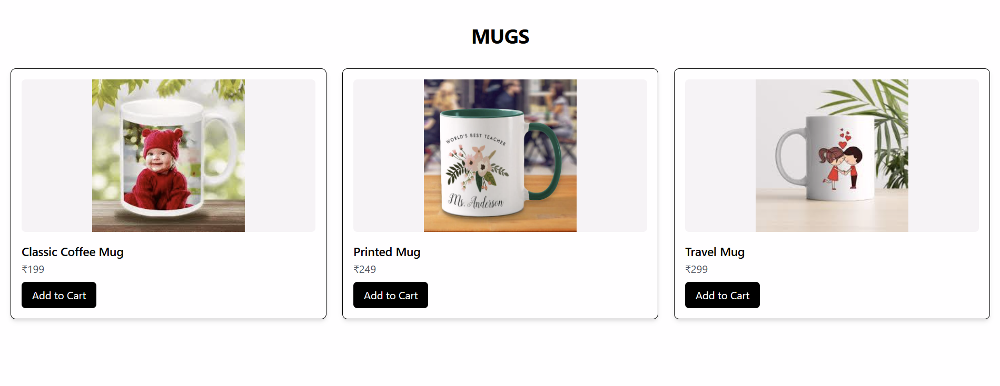
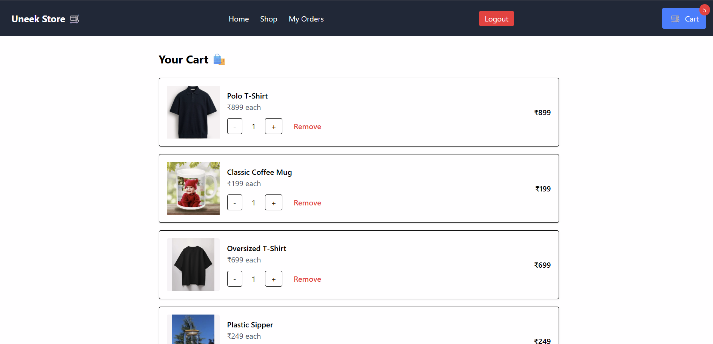
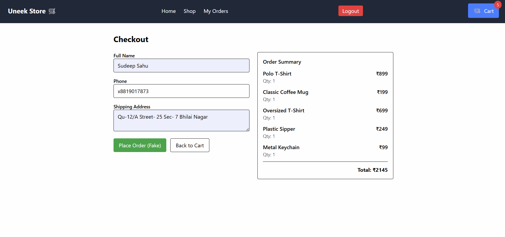

# React + Vite

This template provides a minimal setup to get React working in Vite with HMR and some ESLint rules.

Currently, two official plugins are available:

- [@vitejs/plugin-react](https://github.com/vitejs/vite-plugin-react/blob/main/packages/plugin-react) uses [Babel](https://babeljs.io/) for Fast Refresh
- [@vitejs/plugin-react-swc](https://github.com/vitejs/vite-plugin-react/blob/main/packages/plugin-react-swc) uses [SWC](https://swc.rs/) for Fast Refresh

# Uneek Store

A **React-based E-commerce website** where users can browse and purchase products like **T-shirts, mugs, tote bags, keychains, caps, jars, and mouse pads**. Users can add items to the cart and proceed to checkout with a smooth shopping experience.

---

## ⚡ Features
- Browse products by categories
- Add products to the cart
- Checkout functionality
- Responsive design for mobile and desktop
- Clean and modern UI

---

## 🛠️ Tech Stack
- **Frontend:** React.js, CSS
- **Build Tool:** Vite
- **State Management:** React useState & Context API
- **Version Control:** Git & GitHub

---

## 🚀 Installation

1. Clone the repository
-git clone https://github.com/Sudeepsahu20/uneek-store.git

Navigate to the project folder
cd uneek-store

Install dependencies
npm install

Start the development server
npm start

## Screenshots

